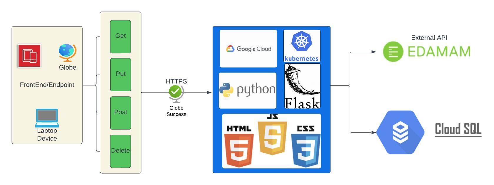
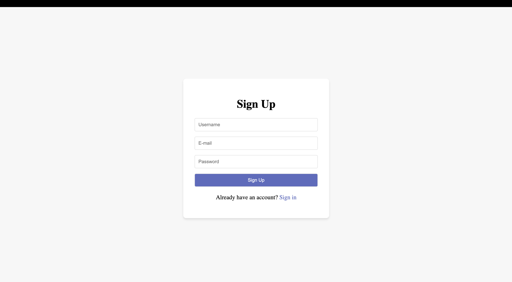
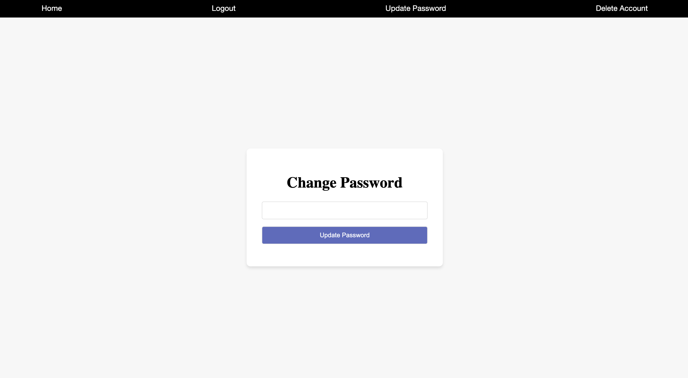
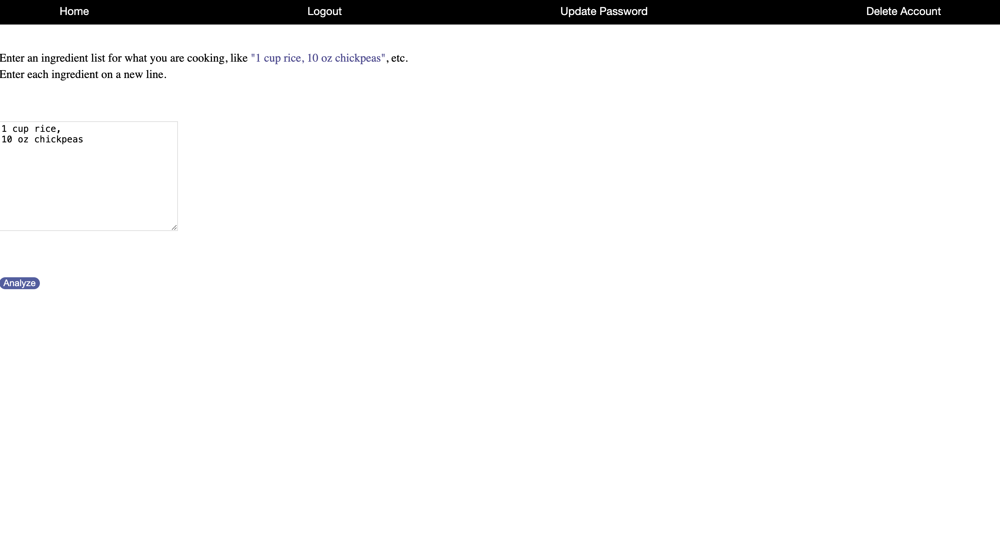
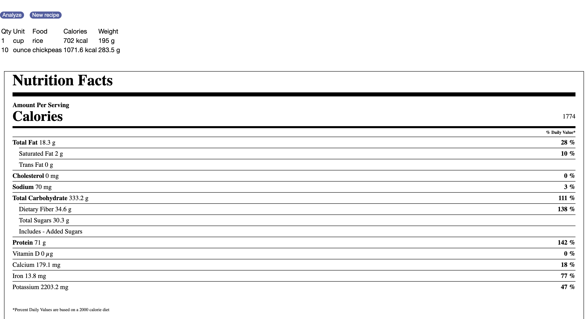

# Nutrition Analysis

## Table of Contents
- [About](#about)
- [Installation](#installation)
- [System Overview](#system-overview)
	- [Terms used for Nutritional Analysis](#terms-used-for-nutritional-analysis)
- [System Architecture](#system-architecture)
- [Application Overview](#application-overview)
- [Application Architecture](#application-architecture)
	 - [Flask App](#flask-app)
	 - [RESTful-API](#restful-api)
	 - [CRUD Operations](#crud-operations)
	 - [External APIs Used](#external-apis-used)
- [Cloud Infrastructure](#cloud-infrastructure)
    - [Google Cloud](#google-cloud)
	- [Kubernetes](#kubernetes)
	- [Docker](#docker)


## About 

In the contemporary world, with a plethora of food choices available, determining the nutritional value of what we consume can be challenging. The use of a nutrition analyzer is valuable in assessing not only the calorie content but also providing contextual information about the food's nutritional composition.This analyser is developed using 
- Nutritional Analysis API for calorie analysis.

This application is developed using python and flask. 


## Installation

Using Flask to build a Nutrional Analyser with Restful API Server.

Clone the repository

```sh
git clone https://github.com/mp-balaji/nutrition_analysis_rest_api.git
```


### Pre-requisites:
- [Python 3.11](https://www.python.org/downloads/release/python-3110/)
- [Google Cloud Platform]()
- [External API](https://developer.edamam.com/edamam-nutrition-api/)


## Running the application locally against a local file database

1. Create virtual environment and install requirements with pip

	```sh
	bash setup.sh
	```
2. Run local database migration script:

	```sh
	bash migrate.sh
	```

3. Run the application:

	```sh
	bash run.sh
	```

## Running the application locally against a GCP Cloud SQL database 

1. Create a GCP CLoud SQL instance and database as described here - [Create a Cloud SQL instance](https://cloud.google.com/sql/docs/mysql/connect-instance-cloud-shell#create-instance)

2. Start a cloud proxy that is connected to the GCP Cloud SQL instance as described in this [guide](https://cloud.google.com/sql/docs/mysql/connect-auth-proxy). 

3. Create virtual environment and install requirements with pip

	```sh
	bash setup.sh
	```

4. Export the environment variables defined in the `config.py` `ProdConfig` class and run:

	```sh
	export FLASK_ENV=prod
	```

4. Run the application using the `run-cloud.sh` script:
	
	```sh
	bash run-cloud.sh
	```

This should now automatically connect to the Cloud SQL database. In a later section of this README the process for connecting to the database when running the application in a Kubernetes cluster will be described.

### Run with Docker

```
$ docker build -t nutrional-analyser:{TAG} .

$ docker run -p 5000:5000 --name nutrional-analyser nutrional-analyser:{TAG}
 
```

This will run the application using a local file database. It is possible to run the application against the Cloud SQL database when running inside a docker container. The most reliable way to do so is to run the cloud proxy on the docker container that is running the application. This is not recommended when running the application in production and for local development the file-based database is acceptable.

### Flask Application Structure 
```
.
|──────nutritional-analysis_rest_api/
| |────Assets/
| |────Kubernetes/
| | |────-deployment.yaml
| | |──────hpa.yaml
| | |──────service.yaml
| | |────service-account.yaml
| |────static/
| | |───CSS/
| | |───images/
| | |──────beauty.css
| | |──────extended_beauty.css
| |────templates/
| | |──────base.html
 | |──────header.html
| | |──────home.html
| | |────login.html
| | |────signup.html
| | |────update.html
| | |────.gitignore
| | |────app.py
| | |────config.py
| | |────contants.py
| | |────Dockerfile
| | |────README.md
| | |────extensions.py
| | |────migrate.sh
| | |────models.py
| | |────README.md
| | |────requirements.txt
| | |────run-cloud.sh
| | |────run.sh
| | |────setup.sh
| | |────views.py
```

## System Overview

The user interface operates seamlessly on the front-end, functioning as a website. On the back-end, there is a Restful service interface designed for CRUD operations, such as querying textual content data. This back-end is deployed on Google Cloud to ensure scalable performance using Kubernetes for the dockerized image. SSL deployments are facilitated through Google Cloud. The application utilizes the Nutritional Analysis API for calculating calorie content in diets. Additionally, Google Cloud SQL serves as the database for storing textual content information.

### Exploring Components in Nutritional Analysis App

**Nutritional Analysis**
The Nutritional Analysis App is a web-based application that allows users to sign up, log in, and analyze their food intake to get information on macro-nutrients and total calories burnt. The application follows a client-server architecture with the front-end serving as a user interface and the back-end providing a RESTful service interface for CRUD operations related to user authentication and food entry. The back-end is deployed on Google Cloud using Kubernetes for scalable performance.

**User Authentication**

Sign Up: Users can sign up by providing their details, which are stored securely in the database.

Login: After signing up, users can log in using their credentials. The database verifies the login details for authentication.

Update password: Existing users can conveniently update their password within the application, ensuring flexibility in managing account access

Delete Account : The application includes a feature allowing users to easily delete their account when they choose not to use the service.

**Food Consumption**

This feature allows users to log food consumption details, including quantity. Upon successful authentication, the application leverages an external nutritional API to provide information on macronutrients and calories burned, enhancing the user's dietary tracking experience.

## System Architecture



## Application Overview


### Main Page
This will be the initial dashboard page, where user will be required to enter signup details that will be stored inside the dbms.Upon submission, users will be redirected to a login page where they can input their usernames and passwords.

Once authenticated, users will be directed to the nutritional analysis page. On this page, users are prompted to enter details about ingredients into a designated text input field for further processing and analysis.

### Sign up page 



### Login page


### Change Password page



### Home Page



### Nutrional Analysis page



## Application Architecture

### Flask App

Flask is a compact and lightweight Python web framework designed to simplify the process of creating web applications. It offers valuable tools and features, making web development in Python more accessible. Its flexibility and simplicity make it particularly beginner-friendly, allowing developers to swiftly build web applications using just one Python file. Flask is also adaptable and doesn't impose a specific directory structure or demand intricate boilerplate code at the outset.

Flask uses the Jinja template engine to dynamically build HTML pages using familiar Python concepts such as variables, loops, lists, and so on. 

### RESTful-API

A REST API, short for Representational State Transfer Application Programming Interface, adheres to the principles of the REST architectural style. It enables interaction with RESTful web services and follows the guidelines established by computer scientist Roy Fielding. REST, which stands for representational state transfer, forms the basis of this approach.

**Flask-RESTful** is an extension designed for Flask, which enhances its capabilities by enabling the efficient creation of REST APIs. This extension provides a streamlined abstraction layer that seamlessly integrates with your current Object-Relational Mapping (ORM) and libraries. Flask-RESTful promotes the adoption of best practices while requiring only minimal configuration. If you are already familiar with Flask, getting acquainted with Flask-RESTful should be a straightforward process.

### CRUD Operations

CRUD stands for "Create, Read, Update, and Delete," which are the four basic database operations. Many HTTP services also model CRUD operations through REST or REST-like APIs.

The four main HTTP methods (GET, PUT, POST, and DELETE) can be mapped to CRUD operations as follows:

-   GET retrieves the representation of the resource at a specified URI. GET should have no side effects on the server.
-   PUT updates a resource at a specified URI. PUT can also be used to create a new resource at a specified URI, if the server allows clients to specify new URIs. For this tutorial, the API will not support creation through PUT.
-   POST creates a new resource. The server assigns the URI for the new object and returns this URI as part of the response message.
-   DELETE deletes a resource at a specified URI.

### External APIs Used

An API is a set of definitions and protocols for building and integrating application software. It’s sometimes referred to as a contract between an information provider and an information user—establishing the content required from the consumer (the call) and the content required by the producer (the response). 

The APIs that are used in the project are described below:

#### Nutritional Analysis API

The Nutritional Analysis API is a custom-built API for analyzing food items and providing information on macro-nutrients and total calories burnt. This API handles user input related to food consumption and leverages a database to store and retrieve nutritional data. The API offers endpoints for CRUD operations, allowing users to interact with their nutritional data efficiently.Users can interact with the Nutritional Analysis API to log their food consumption and receive detailed nutritional information for better insights into their dietary habits.


## Cloud Infrastructure

**Cloud computing infrastructure** is the collection of hardware and software elements needed to enable cloud computing. It includes computing power, networking, and storage, as well as an interface for users to access their virtualised resources. The virtual resources mirror a physical infrastructure, with components like servers, network switches, memory and storage clusters.

 **Why Cloud Computing Infrastructure?**
 
Cloud infrastructure offers the same capabilities as physical infrastructure but can provide additional benefits like a lower cost of ownership, greater flexibility, and scalability.

Cloud computing infrastructure is available for private cloud, public cloud, and hybrid cloud systems. It’s also possible to rent cloud infrastructure components from a cloud provider, through cloud infrastructure as a service (Iaas). Cloud infrastructure systems allow for integrated hardware and software and can provide a single management platform for multiple clouds.

### Google Cloud

Why google cloud? 

Google Cloud Platform (GCP) naturally offers a more limited range of services and doesn’t command the same global spread of data centre offered by AWS and Azure. It does, however, give customers a highly specialised service in three main streams: big data, machine learning, and analytics, with good scale and stable load balancing, as well as those famously low response times. Google’s container offering provides users with a significant advantage as it developed the very Kubernetes standard now utilised by competitors AWS and Azure.

Customers tend to choose GCP as a secondary vendor in a hybrid solution, though it is becoming increasingly popular with organisations that are direct competitors with Amazon, and therefore cannot use AWS. It’s important to note that GCP is very open-source- and DevOps-centric, and as a result does not integrate as well with Microsoft Azure.

This distribution of resources provides several benefits, including redundancy in case of failure and reduced latency by locating resources closer to clients. This distribution also introduces some rules about how resources can be used together.

#### Cloud SQL

Why Google Cloud SQL?

Cloud SQL is a fully managed relational database service offered by Google Cloud Platform. It allows you to run and manage popular databases like MySQL, PostgreSQL, and SQL Server in the cloud without the overhead of database administration.Cloud SQL provides features like automated backups, scaling, high availability, and security, making it easy to deploy, maintain, and scale databases for your applications in the cloud.

Cloud SQL is designed to provide consistent performance with the capability to handle large amounts of traffic and data processin. It integrates with other cloud services provided by the cloud vendor, such as cloud compute services, for a seamless cloud experience.Cloud SQL services include automated backups and point-in-time recovery to safeguard data.Cloud SQL services are often compliant with common industry standards and certifications, which can help users meet their compliance obligations.

### Docker

Docker is a platform that is openly accessible for the development, transportation, and execution of applications. It allows for the isolation of applications from infrastructure, facilitating swift software delivery. Docker empowers you to handle your infrastructure much like your applications, leveraging its approaches to expedite the shipping, testing, and deployment of code. This results in a substantial reduction in the time gap between code creation and its production implementation.

Docker offers the capability to encapsulate and execute an application within a flexibly isolated environment known as a container. This isolation and security feature enable the concurrent operation of numerous containers on a specific host. Containers are lightweight and encompass all the essentials for running an application, eliminating the reliance on the host's current installations. Sharing containers during collaboration is straightforward, ensuring that everyone receives an identical container that functions uniformly.

Docker provides tooling and a platform to manage the lifecycle of your containers:

-   Develop your application and its supporting components using containers.
-   The container becomes the unit for distributing and testing your application.
-   When you’re ready, deploy your application into your production environment, as a container or an orchestrated service. This works the same whether your production environment is a local data centre, a cloud provider, or a hybrid of the two.

### Kubernetes

Kubernetes is a portable, extensible, open source platform for managing containerised workloads and services, that facilitates both declarative configuration and automation. It has a large, rapidly growing ecosystem. Kubernetes services, support, and tools are widely available.

Kubernetes, at its basic level, is a system for running and coordinating containerised applications across a cluster of machines. It is a platform designed to completely manage the life cycle of containerised applications and services using methods that provide predictability, scalability, and high availability.

Kubernetes allows users to run scalable, highly available containerised workloads on a highly abstracted platform. While Kubernetes’ architecture and set of internal components can at first seem daunting, their power, flexibility, and robust feature set are unparalleled in the open-source world.

A description of how this application is deployed to Kubernetes can be found [here](./kubernetes/README.md).

**Creating and running an application in a GKE Kubernetes cluster:**

In order to deploy the resources in the `kubernetes` directory to a Kubernetes cluster in GCP, and run this application on the cluster, a number of steps are required. The cluster must be created in the GCP console, and service account configuration must be applied to the cluster so that it can access the Cloud SQL instance required by the application. The steps to do this are described in this [guide](https://cloud.google.com/sql/docs/mysql/connect-kubernetes-engine).

